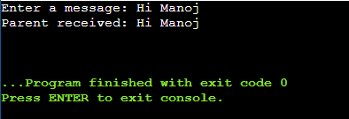

# OS-EX.6-IMPLEMENTATION-OF-INTER-PROCESS-COMMUNICATION-USING-PIPE

## AIM:
To Write C program to illustrate IPC using pipes mechanisms.

## ALGORITHM:
### Step 1:
Create a pipe (pipe(fd)).
### Step 2:
Fork a child process (child_pid = fork()).
### Step 3:
In the child process:
    1. Close the read end of the pipe (close(fd[0])).
    2. Write a message to the pipe (write(fd[1], message, strlen(message) + 1)).
    3. Close the write end of the pipe (close(fd[1])).
    4. Exit the child process (exit(EXIT_SUCCESS)).
### Step 4:
In the parent process:
    1. Close the write end of the pipe (close(fd[1])).
    2. Read a message from the pipe (read(fd[0], received_message, sizeof(received_message))).
    3. Close the read end of the pipe (close(fd[0])).
    4. Print the received message (printf("Parent received: %s\n", received_message)).
    5. Parent process continues execution.
### Step 6:
End of the program (return 0 in the parent process).

## PROGRAM:
```
import os

def main():
    message = input("Enter a message: ").encode()
    parent_pipe, child_pipe = os.pipe()

    child_pid = os.fork()

    if child_pid == 0:
        os.close(parent_pipe)
        os.write(child_pipe, message)
        os.close(child_pipe)
        exit(0)
    else:
        os.close(child_pipe)
        received_message = os.read(parent_pipe, 100)
        os.close(parent_pipe)
        print("Parent received:", received_message.decode())

if __name__ == "__main__":
    main()


```


## OUTPUT:

## Result:
This output confirms that the parent process successfully received and printed the message sent by the child process through the pipe, demonstrating inter-process communication using pipes.


